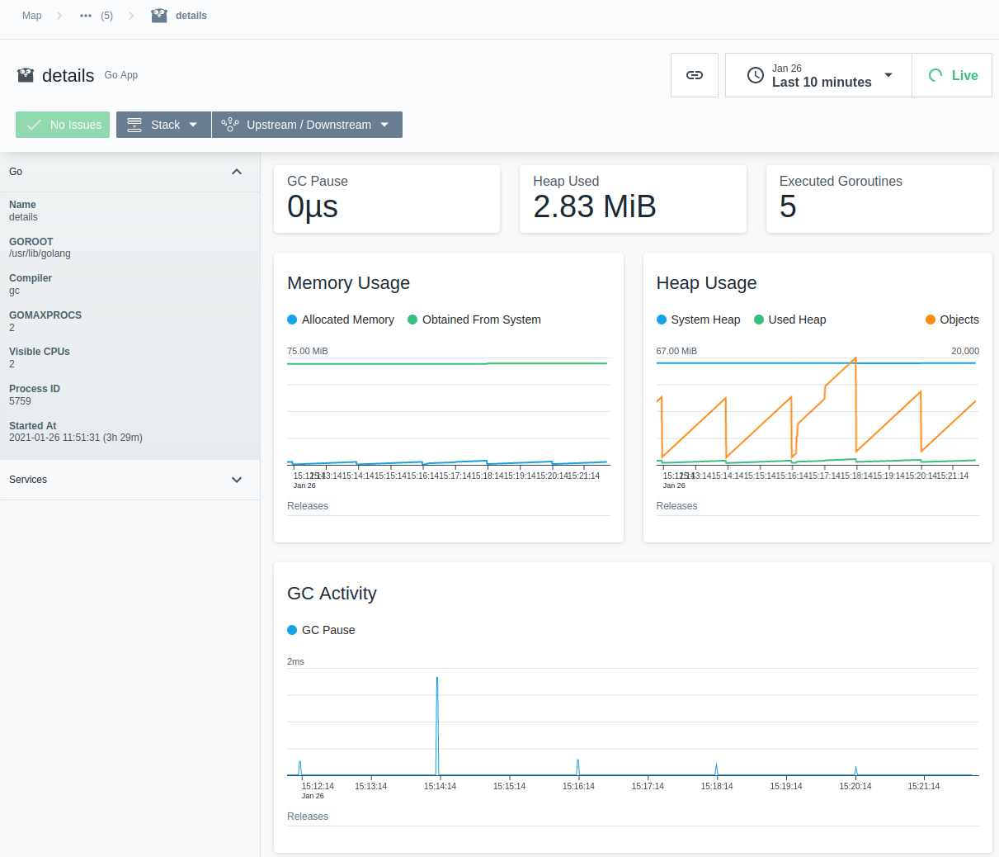
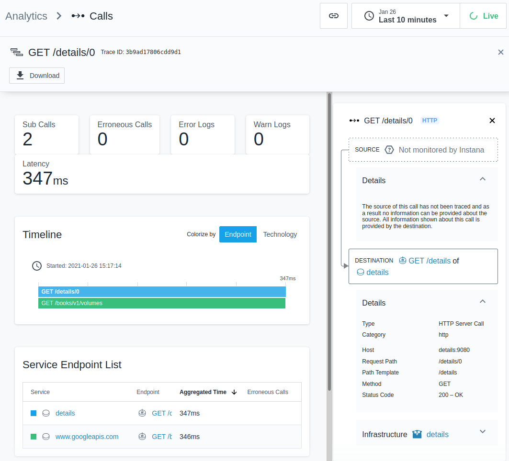

# Instana Go application monitoring
Getting-started with [Instana](https://www.instana.com/) monitoring and tracing of Go applications in Kubernetes.

The tutorial will show you how to quickly instrument a simple Go application for runtime monitoring and HTTP request tracing including steps for building and deploying to a Kubernetes cluster. The goal is to provide an approachable explanation and hand-on practise for non-coders to get basic understanding of the application instrumentation topic.

## Pre-requisites
The tutorial requires that you have Docker or Podman installed on your local machine. You will also need a Go installation to compile and build the binary locally. If you prefer not to install Go locally you can use a Go builder image instead. Makefile targets are available for both build options as well as for Podman and Docker respectively. Minikube is used as our test Kubernetes environment.


We'll use the well-known [Istio Bookinfo application](https://istio.io/latest/docs/examples/bookinfo/) with a [custom drop-in Go version](https://github.com/styblope/details-go) of the `details` service.

## Clone the repository
Clone this repo to your local machine.
```sh
git clone https://github.com/styblope/instana-tracing-go
cd instana-tracing-go
```

## Setup minikube and deploy the Bookinfo app
We'll first setup our Kubernetes environment and deploy the original Istio Bookinfo application from the provided yaml file.
```sh
minikube start

kubectl create -n default -f bookinfo.yaml

# expose the frontend service
kubectl patch service productpage --patch='{"spec":{"type":"NodePort"}}'

# open the app in browser
minikube service productpage
```

## Build the Go `details` service
Next, we are going to build the Go version of the `details` service, package it into a container image and replace the original image.
```sh
cd details-go

# if you have Go installed locally
make build-docker

# if want to build using the Go builder image
make build-docker-with-builder
```

Push the newly built image to minikube's in-cluster Docker
```
docker save examples-bookinfo-details-go-v1 | minikube ssh --native-ssh=false docker load
```

Replace the image repository in `details-v1` deployment with the newly created local image
```
kubectl set image deploy/details-v1 details=localhost/examples-bookinfo-details-go-v1:latest
```

Verify that the drop-in version of the `details` microservice works by opening up the Bookinfo frontpage in your browser (add `/productpage` endpoint to the end of the URL or click on the "Normal user" link)
```
minikube service productpage
```

## Setup Instana agent
Before we proceed to instrument our new Go application, we must first install and configure the Instana monitoring agent. Install the Instana agent as Kubernetes using the agent with help of the agent installation wizard or follow the [installation documentation](https://www.instana.com/docs/ecosystem/kubernetes/).

After the host agent is running and connected to the Instana backend, we need to configure network access to the agent in our `details-v1` deployment [4] 
```
kubectl edit deploy/details-v1
```
and insert the following environment variable configuration. This will ensure the in-app Go sensor will be able to connect to the host agent on the node.
```yaml
spec:
  containers:
    env:
      - name: INSTANA_AGENT_HOST
        valueFrom:
          fieldRef:
            fieldPath: status.hostIP
```
This will ensure the in-app Go sensor will connect to the host agent running on the same node as the application pod.


## Instrument the Go application
This section walks through the basic concepts of Go application instrumentation and highlight the key . You can refer to the [finished example](details-instrumented.go) to see the actual code changes and compare it with the [original version](./details-go/details.go).

In order to use the Instana instrumentation, we must first import `instana/go-sensor` package at the top of our application code.
```go
import instana "github.com/instana/go-sensor"
```

Getting straight to the business, we'll now create and initialize the Go sensor with just a single line of code. Calling [`instana.NewSensor`](https://pkg.go.dev/github.com/instana/go-sensor/#NewSensor) we'll create a new sensor and store it in a global variable so we can use it across all request handler functions.
```go
var sensor = instana.NewSensor("details")
```
This makes for the minimal needed sensor instrumentation to start collecting in-app metrics and forward them to the host agent (`instana-agent` daemonset pod). At this point, however, only **Go runtime metrics** (garbage collector activity, memory and heap usage, number of goroutines) are collected. These runtime performance metrics can be seen in the  **Service->Infrastructure UI** perspective.



Let's further add **HTTP trace collection** instrumentation. We'll wrap the original `http.HandleFunc` into `instana.TracingHandlerFunc` in the `main()` function to enable collection of incoming http requests.
```go
fn main() {
...
	http.HandleFunc("/details/", instana.TracingHandlerFunc(sensor, "/details", details))
...
    }
```
The above handler wrapper will provide the basic "black-box" tracing, i.e. we'll just obtain the overall service tracing visibility as a single *span* per endpoint. This is good enough for a very simple static response like we have in our default demo service configuration. In real life however, the situation get more complex and interesting. An HTTP service usually involves a number of other dependent tasks such as database queries or external API calls that, each of which impacts the overall service performance and availability. We thus need to get a deeper insight into the inner workings of the service by adding more "white-box" instrumentation to the code. Our `details` application allows us to simulate the situation by querying an actual external API instead of a static content.

To enable the external Google Books API query, set the `ENABLE_EXTERNAL_BOOK_SERVICE` environment variable in the `details-v1` deployment:
```
kubectl set env deploy/details-v1 ENABLE_EXTERNAL_BOOK_SERVICE="true"
```
Test the modification by opening up the Bookinfo `/productpage` page and check if the book details have changed. You should also note a slight delay before the page is loaded which is caused by time to receive the response to the external API request.

We can now enhance our code by instrumenting the external request handling function, which will result in creation of a new *child span* tracing just this sub-transaction. Instana Go API again provides a wrapper function that is used in place of the default request executor matching the `http.RoundTripper` interface.
```go
func fetchDetailsFromExternalService(isbn string, id int, headers http.Header, ctx context.Context) *Details {
...
	tr := &http.Transport{
		TLSClientConfig: &tls.Config{InsecureSkipVerify: true}}
	req, err := http.NewRequest("GET", uri, nil)
	if err != nil {
		return &Details{}
	}
	client := &http.Client{Transport: instana.RoundTripper(sensor, tr), Timeout: 5 * time.Second}
	res, err := client.Do(req.WithContext(ctx))
...
```
Note that in order to create a child span we must tie it to the main (parent) span by passing along the incoming request context.

You can get the service analysis and trace details by selecting the **Analyze Calls** perspective in the Instana UI. Drilling down to the individual request you will a similar picture like this:



## Build and deploy to minikube
To build and deploy the instrumented application execute the following commands:
```sh
cp details.go details.go.original
cp ../details-intrumented.go details.go

# if you gave Go installed locally
make build-docker
# if you want to use the builder image
make build-docker-with-builder

# transfer image to minikube
docker save examples-bookinfo-details-go-v1 | minikube ssh --native-ssh=false docker load
# restart pod
kubectl delete pod -n default -l app=details
```


## Resources:
[1] https://github.com/instana/go-sensor  
[2] https://www.instana.com/blog/instana-monitoring-for-go/  
[3] https://www.instana.com/docs/ecosystem/go/  
[4] https://www.instana.com/docs/setup_and_manage/host_agent/on/kubernetes/#configure-network-access-for-monitored-applications  
[5] https://github.com/styblope/details-go
